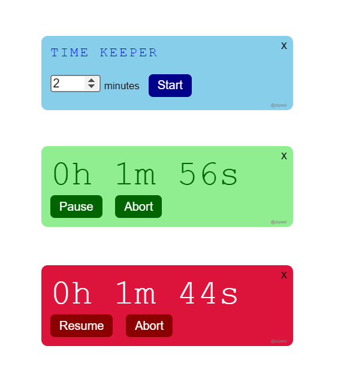

# TIME KEEPER

A simple application for count down timer.

## Screenshots

## Technical Details
Built using

- Angular v10.0.14
- Electron v9.3.0
- Electron Builder v22.8.0

## Commands

|Command|Description|
|--|--|
|`npm run ng:serve`| Execute the app in the browser |
|`npm run build`| Build the app. Your built files are in the /dist folder. |
|`npm run build:prod`| Build the app with Angular aot. Your built files are in the /dist folder. |
|`npm run electron:local`| Builds your application and start electron
|`npm run electron:build`| Builds your application and creates an app consumable based on your operating system |

